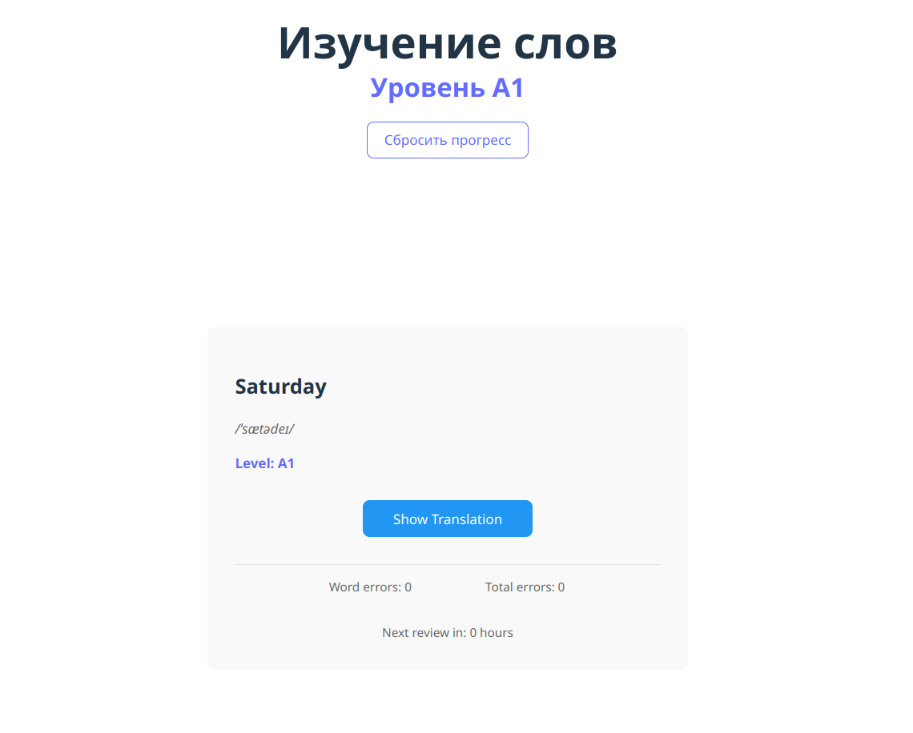

# learn-words

Сделанная с использованием React игра для изучения слов из словарей Oxford 3000 и 5000 (A1-C2).

Made with react a game for learning words from Oxford 3000 & 5000 dictinary (A1-C2).

Demo: https://hightemp.github.io/learn-words/

